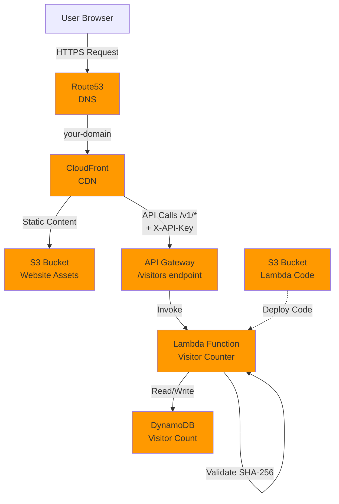

# AWS Cloud Resume

A serverless resume website built as part of the [Cloud Resume Challenge](https://cloudresumechallenge.dev/), featuring a visitor counter and deployed entirely through infrastructure as code.

## Project Overview

This project demonstrates a full-stack cloud application deployed on AWS with automated CI/CD pipelines. The resume website is hosted on CloudFront with a serverless backend that tracks visitor counts.

### Architecture

- **Frontend**: Static HTML/CSS/JavaScript hosted on S3 and distributed via CloudFront
- **Backend**: Python Lambda function for visitor tracking
- **Database**: DynamoDB table for storing visitor count
- **API**: API Gateway REST API with API key authentication
- **DNS**: Route53 for custom domain management
- **Security**: ACM certificate for HTTPS, CloudFront security headers, API key authentication with SHA-256 validation

### Infrastructure

All infrastructure is defined as code using AWS CloudFormation templates:

- `s3-setup.yaml` - S3 bucket for Lambda source code
- `dynamodb-setup.yaml` - DynamoDB table for visitor tracking
- `lambda-setup.yaml` - Lambda function with IAM roles and permissions
- `api-gateway-setup.yaml` - REST API with Lambda integration
- `cloudfront-setup.yaml` - CloudFront distribution with S3 and API Gateway origins

### CI/CD Pipeline

Automated deployment using GitHub Actions with:

- **Centralized Configuration**: All settings in `.github/workflows/config.yaml`
- **Reusable Components**: Composite actions for AWS credentials and stack outputs
- **Dependency Management**: Proper enforcement of infrastructure dependencies
- **Automatic Triggers**: Deploy on infrastructure or code changes
- **Manual Control**: Selective deployment via workflow dispatch

**Manual Deployments:**
- Full pipeline orchestration via `main.yaml` workflow
- Selective component deployment with dependency validation

### Key Features

- Serverless architecture (no servers to manage)
- Infrastructure as Code (CloudFormation)
- Automated CI/CD (GitHub Actions)
- Custom domain with HTTPS
- Secure API authentication (CloudFront injects X-API-Key, Lambda validates SHA-256 hash)
- Visitor counter with DynamoDB
- CloudFront CDN for global distribution
- Security headers and best practices

For detailed pipeline architecture and deployment instructions, see:
- [PIPELINE_ARCHITECTURE.md](PIPELINE_ARCHITECTURE.md) - Complete CI/CD documentation
